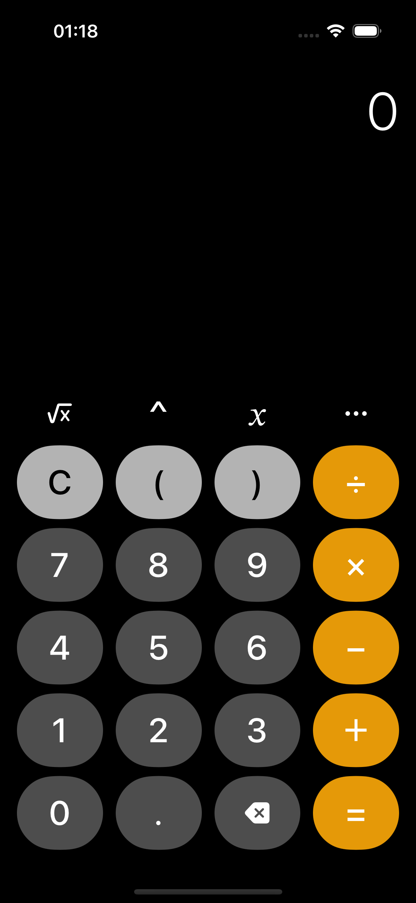
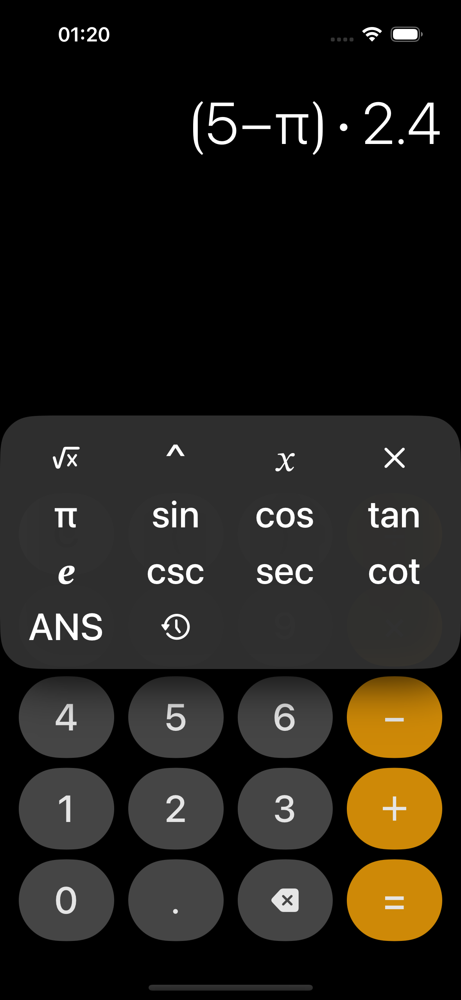
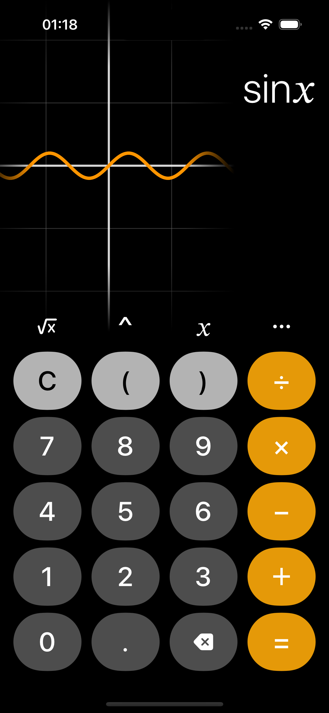
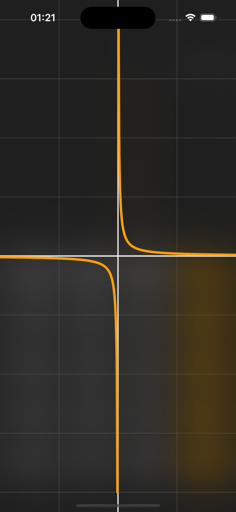

# Better iOS Calculator

A feature-rich iOS calculator app with advanced functionalities, including graphs, trigonometry functions, calculation history, and more.

## Features

- **Graphical Representation**: Visualize mathematical functions with interactive graphs.
- **Trigonometry**: Perform calculations involving trigonometric functions.
- **Calculation History**: View and recall your previous calculations.
- **Additional Functions**: Explore a wide range of mathematical operations.

## Screenshots

  
  

  
  

## Installation

To use the Improved iOS Calculator, follow these steps:

1. Clone the repository: `git clone https://github.com/VinzentHubrich/SwiftCalculator.git`
2. Open the project in Xcode.
3. Build and run the app on your iOS device or simulator.

Feel free to [report issues or make suggestions](https://github.com/VinzentHubrich/SwiftCalculator/issues) to improve this calculator app.
